# Terrain-Topology-Algorithms

This project is collection of algorithms that can be used to describe the topology of a terrain. The result of these algorithms can then be used for rendering the terrain or as input to other algorithms.

The formulas were take from a book called Digital Terrain Analysis for Soil Science.

Version 2 adds more curvature types, landform and residual types as well as a better way to visualize the maps using a color gradient and rescaling the wide dynamic range using a logarithmic scale.

The colorized maps can be displayed using a cool to warm or black to white gradient.

## Normal map

The normal map is probably the most common algorithm used to describe the topology of a terrain because of its use in rendering. The normal's are a tangent space vector of the surface direction.

Its a good place to start as it requires calculating the first order derivatives of the terrains height map which are also used in many of other algorithms.

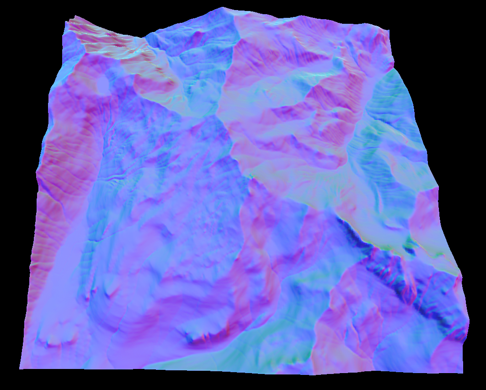

## Slope map

The slope map describes the steepness of the terrain and is handy for texturing the terrain. Like the normal map this also requires the first order derivatives.

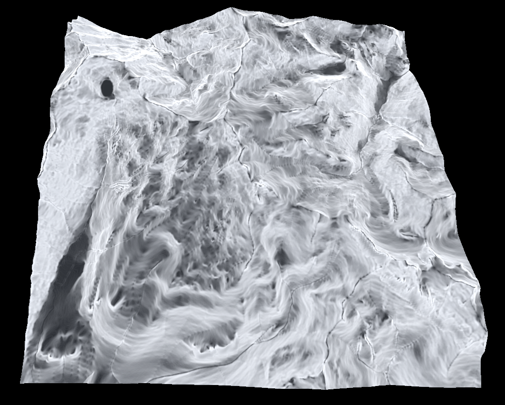

## Aspect map

This is similar to the slope map but instead represents the horizontal gradient as opposed to the vertical gradient.

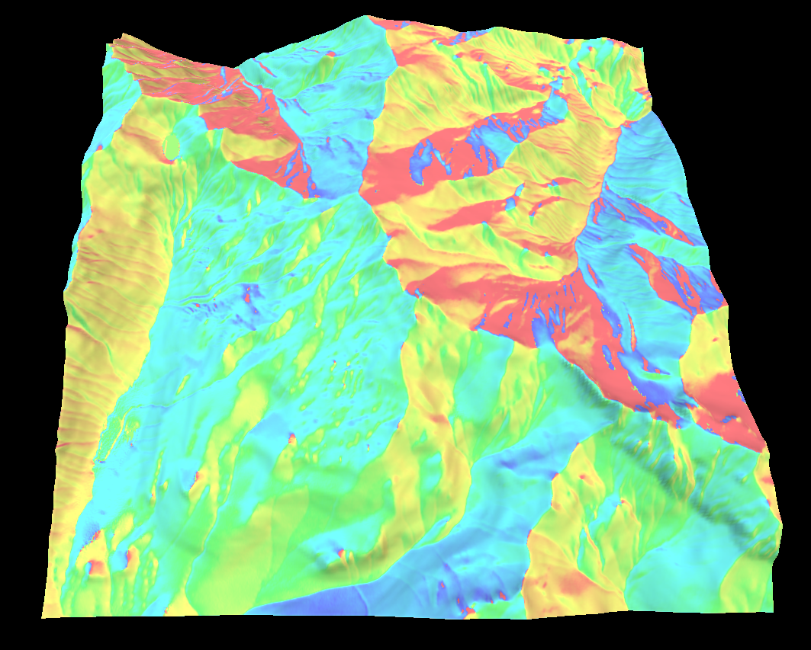

## Curvature map

The curvature map represents the convexity/concavity of the surface. The curvature is a little more complicated to calculate and requires the first and second order derivatives of the terrains height.

There are a lot of ways to measure the curvature. The most useful are vertical, horizontal, mean, gaussian, minimal or maximal curvature but I have provide a few others.

Since curvature uses the second derivatives it can have quite a large dynamic range and can be negative which makes visualizing the map a bit tricky.

Below is the horizontal, vertical, gaussian, minimal and maximal curvatures in that order.

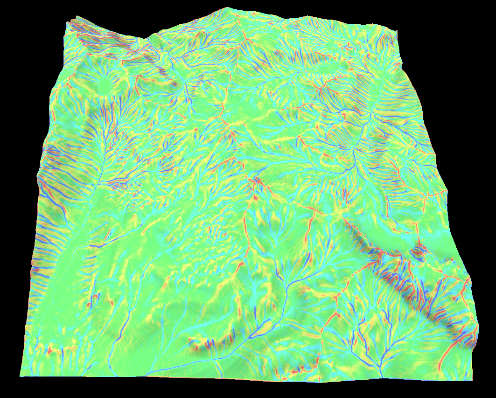

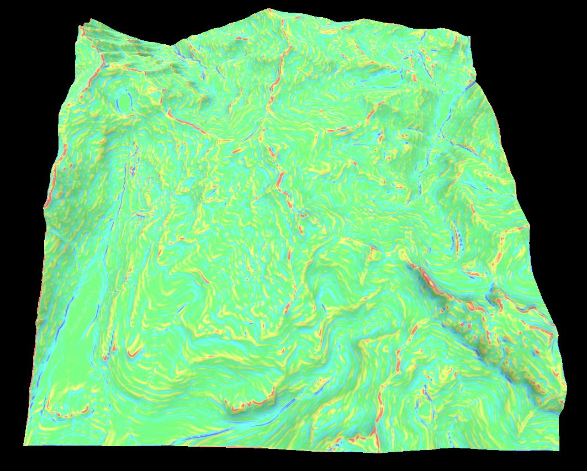

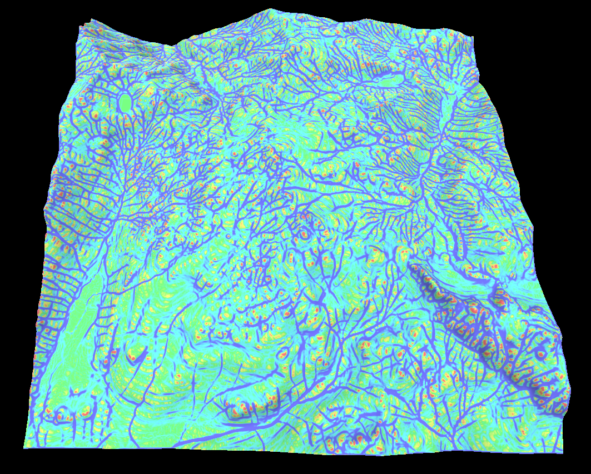

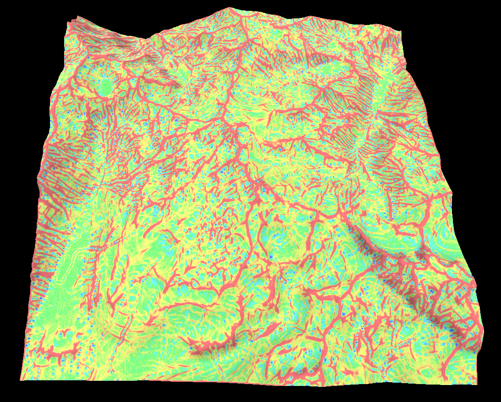

## Landform map

The landform map combines some of the curvature values to try and classify the type of landform. For example if the landform is convex/concave or accumulative/dispersive. 

The idea is the the shape of the landform determines how water flows over it which is a key indicator for soil type and depth.

Below is the shape index and accumulation landforms in that order.

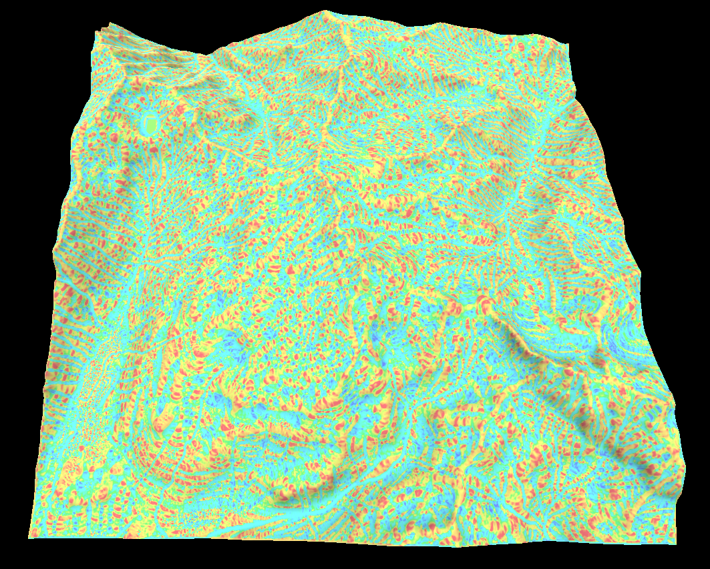

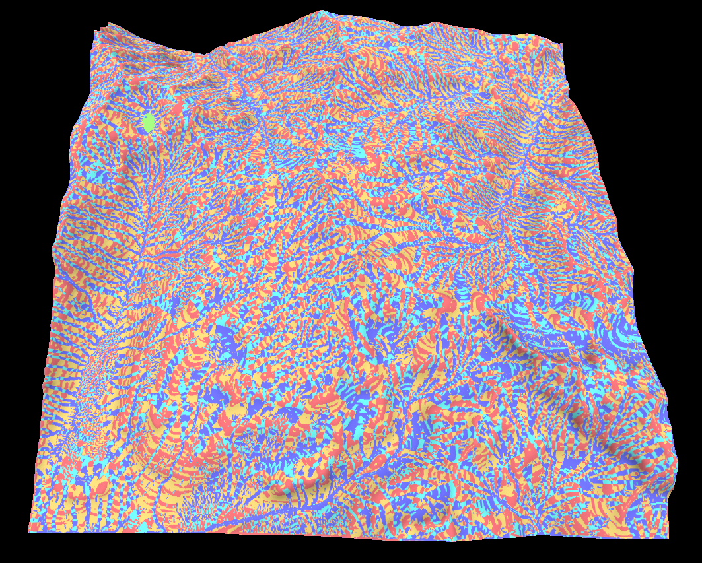

## Flow map

This one is a bit different as its a iterative algorithm and is therefore a bit slow. Its works by simulating the path a small amount of water flowing over the terrain will take. The magnitude of the waters velocity can then be used to create a flow map.

Its a good way to make rivers or erosion effects.

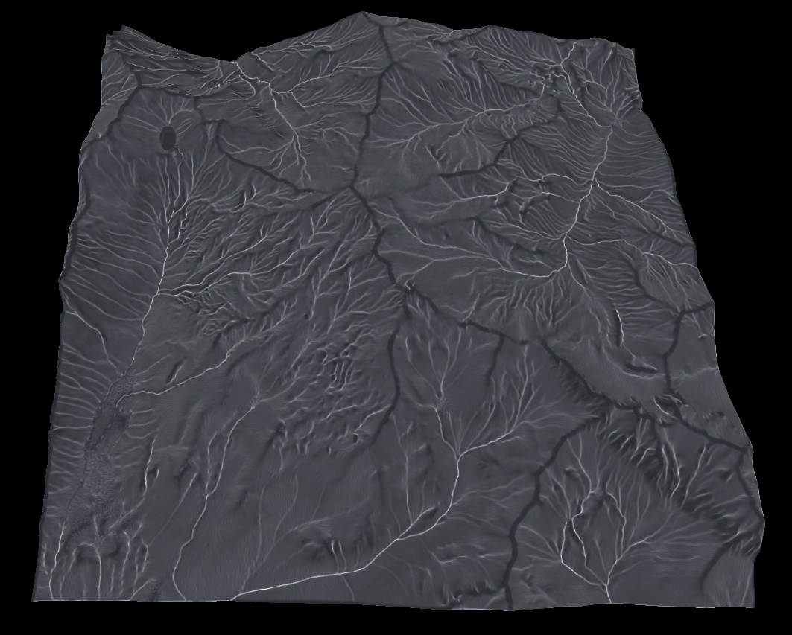

## Residual map

The residual map takes the heights around a point in a given window and performs some sort of statistical analysis. For example the standard deviation represents the roughness of the terrain.

Options to calculate the mean, standard deviation, percentile and a few others are provided.

Below is the percentile map where the value represents the percentage of heights around a point that are lower.

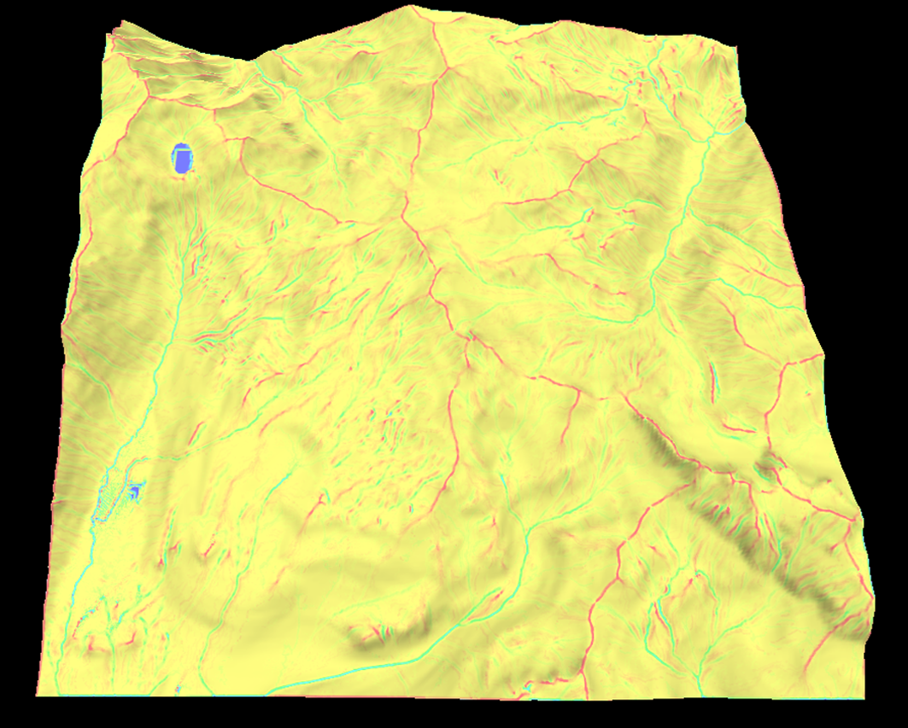

